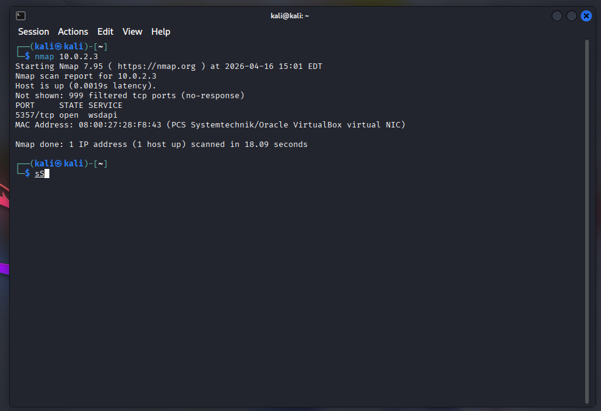
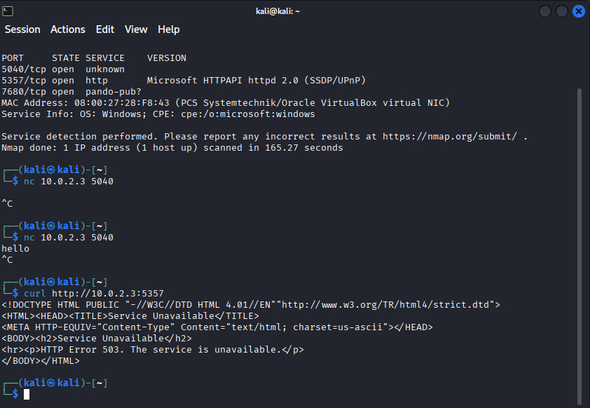

# Network Scanning and Service Analysis Lab

## Overview

This project demonstrates a cybersecurity lab focused on network scanning and service analysis.

The objective was to identify active hosts, discover open ports, analyze running services, and understand how systems expose network functionality.

---

## Lab Setup

* Attacker Machine: Kali Linux
* Target Machine: Windows 10 Virtual Machine
* Environment: VirtualBox (NAT Network)

---

## Tools Used

* Nmap (network scanning and service detection)
* Netcat (manual interaction)
* Curl (HTTP interaction)

---

## Key Activities

### 1. Initial Network Scan

* Identified active host
* Discovered open ports

### 2. Service Analysis

* Detected running services and versions
* Identified HTTP-based service on port 5357

### 3. Full Port Scan

* Performed deep scan using `-p-`
* Discovered additional open ports (5040, 7680)

### 4. Manual Interaction

* Connected to port 5040 using Netcat
* Attempted communication with the service

### 5. HTTP Interaction

* Sent request using Curl
* Received HTTP 503 (Service Unavailable) response

---

## Key Findings

* Multiple open ports were identified (5040, 5357, 7680)
* Port 5357 is running a Microsoft HTTP service (WSDAPI)
* Port 7680 is associated with Windows Update Delivery Optimization
* Port 5040 accepted connections but did not respond to standard input

---

## Example Output

Initial Nmap scan showing open ports*

HTTP interaction showing 503 Service Unavailable*

---

## Conclusion

This lab demonstrates the importance of network scanning and service analysis in identifying exposed services. It highlights how systems can present multiple entry points and why deeper investigation is necessary to understand their behavior.

---

## Author

VEIDEE

